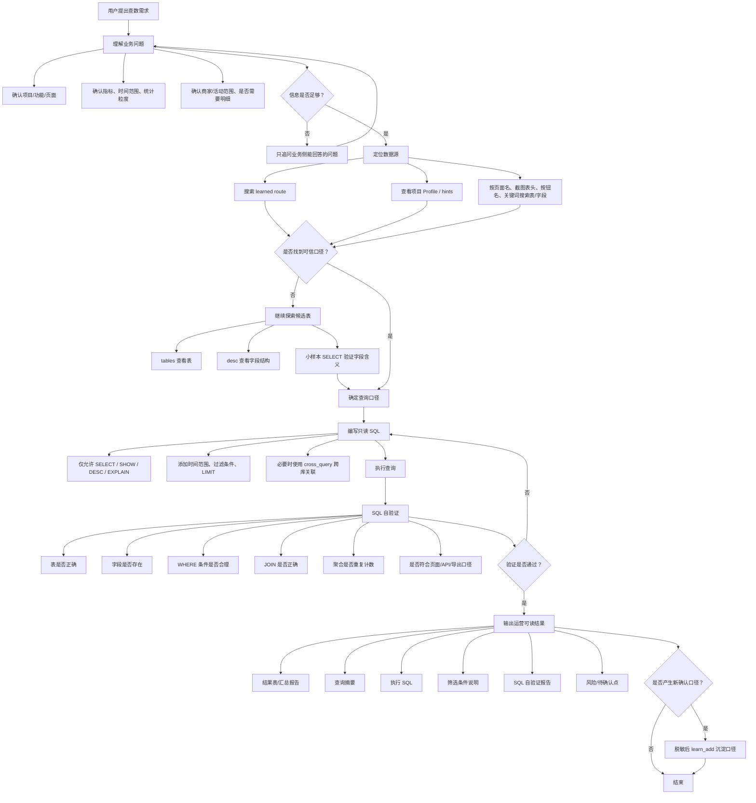

# 数据库查询助手 Workflow

```mermaid
flowchart TD
    A["用户提出查数需求"] --> B["理解业务问题"]
    B --> B1["确认项目/功能/页面"]
    B --> B2["确认指标、时间范围、统计粒度"]
    B --> B3["确认商家/活动范围、是否需要明细"]

    B --> C{"信息是否足够？"}
    C -- "否" --> C1["只追问业务侧能回答的问题"]
    C1 --> B
    C -- "是" --> D["定位数据源"]

    D --> D1["搜索 learned route"]
    D --> D2["查看项目 Profile / hints"]
    D --> D3["按页面名、截图表头、按钮名、关键词搜索表/字段"]

    D1 --> E{"是否找到可信口径？"}
    D2 --> E
    D3 --> E

    E -- "否" --> F["继续探索候选表"]
    F --> F1["tables 查看表"]
    F --> F2["desc 查看字段结构"]
    F --> F3["小样本 SELECT 验证字段含义"]
    F3 --> G["确定查询口径"]

    E -- "是" --> G["确定查询口径"]

    G --> H["编写只读 SQL"]
    H --> H1["仅允许 SELECT / SHOW / DESC / EXPLAIN"]
    H --> H2["添加时间范围、过滤条件、LIMIT"]
    H --> H3["必要时使用 cross_query 跨库关联"]

    H --> I["执行查询"]
    I --> J["SQL 自验证"]

    J --> J1["表是否正确"]
    J --> J2["字段是否存在"]
    J --> J3["WHERE 条件是否合理"]
    J --> J4["JOIN 是否正确"]
    J --> J5["聚合是否重复计数"]
    J --> J6["是否符合页面/API/导出口径"]

    J --> K{"验证是否通过？"}
    K -- "否" --> H
    K -- "是" --> L["输出运营可读结果"]

    L --> L1["结果表/汇总报告"]
    L --> L2["查询摘要"]
    L --> L3["执行 SQL"]
    L --> L4["筛选条件说明"]
    L --> L5["SQL 自验证报告"]
    L --> L6["风险/待确认点"]

    L --> M{"是否产生新确认口径？"}
    M -- "是" --> N["脱敏后 learn_add 沉淀口径"]
    M -- "否" --> O["结束"]
    N --> O["结束"]
```

